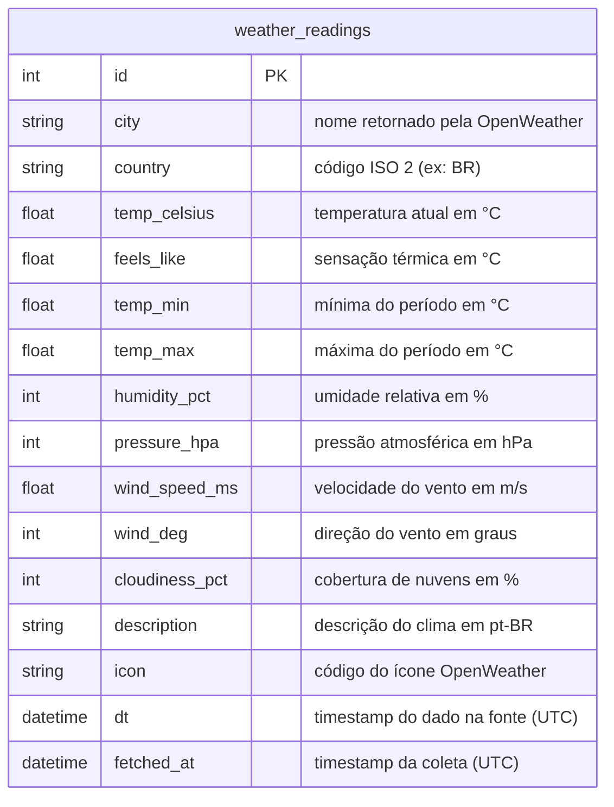
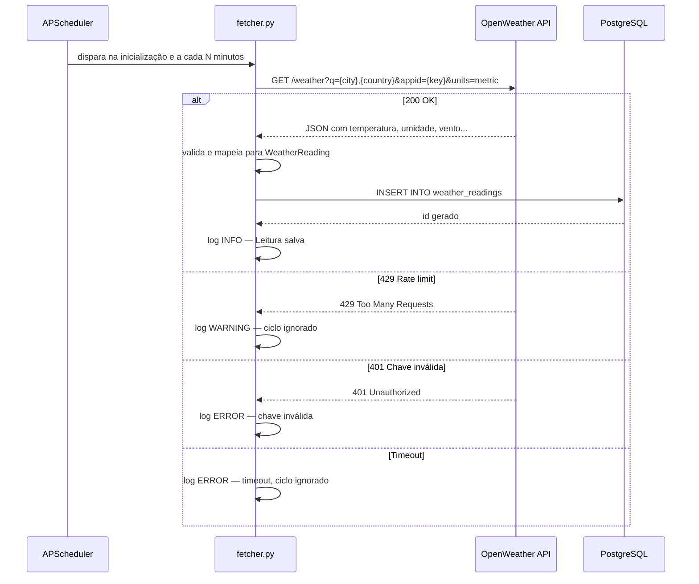
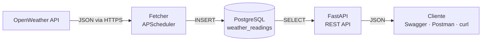

# GnTech Weather API

Pipeline de dados climáticos desenvolvido como desafio técnico. Coleta automaticamente dados
da [OpenWeather API](https://openweathermap.org/api), armazena em PostgreSQL e os expõe via
API REST documentada com Swagger. Todo o ambiente — API e banco — sobe com um único comando Docker.

## Como subir o projeto

```bash
# Desenvolvimento (hot-reload, Swagger disponível)
docker-compose up --build

# Produção/avaliação (sem hot-reload, Swagger indisponível)
docker-compose -f docker-compose.prod.yml up --build
```

| Serviço | Desenvolvimento | Produção/avaliação |
|---|---|---|
| API REST | http://localhost:8000 | http://localhost:8000 |
| Swagger UI | http://localhost:8000/docs | indisponível (404) |
| ReDoc | http://localhost:8000/redoc | indisponível (404) |
| PostgreSQL | localhost:5432 | localhost:5432 |

Na inicialização o container executa automaticamente as migrations (`alembic upgrade head`) e
realiza a primeira coleta de dados — o banco já estará populado quando o Swagger carregar.

## Variáveis de ambiente

Copie `.env.example` para `.env` e preencha antes de subir:

```bash
cp .env.example .env
```

| Variável | Descrição | Exemplo |
|---|---|---|
| `OPENWEATHER_API_KEY` | Chave da OpenWeather API (gratuita em openweathermap.org) | `abc123...` |
| `DATABASE_URL` | String de conexão PostgreSQL | `postgresql://weather:weather@db:5432/weather_db` |
| `POSTGRES_USER` | Usuário do banco | `weather` |
| `POSTGRES_PASSWORD` | Senha do banco | `weather` |
| `POSTGRES_DB` | Nome do banco | `weather_db` |
| `CITIES` | Cidades monitoradas, separadas por `;` | `Florianopolis,BR` ou `Florianopolis,BR;Sao Paulo,BR` |
| `FETCH_INTERVAL_MINUTES` | Intervalo entre coletas automáticas | `30` |
| `ENV` | Ambiente — `development` habilita Swagger | `development` |

> A chave da OpenWeather pode levar até 10 minutos para ativar após o cadastro. Se o fetcher
> retornar 401 na primeira execução, aguarde e o próximo ciclo funcionará normalmente.

## Modelo de dados

Uma tabela armazena cada leitura climática coletada da OpenWeather:



> `dt` é o timestamp do dado na fonte OpenWeather — pode refletir um cache de até 10 minutos.
> `fetched_at` é o momento exato em que a aplicação realizou a requisição. Ambos são armazenados
> para permitir diagnóstico de latência e frequência de ingestão.

### Mapeamento requisito → implementação

| Requisito do enunciado | Implementação |
|---|---|
| Requisição GET com parâmetros dinâmicos | `GET api.openweathermap.org/data/2.5/weather?q={city},{country}&units=metric` |
| Autenticação por chave de API | Parâmetro `appid` na query string; chave lida de variável de ambiente, nunca no código |
| Armazenar em banco relacional | Tabela `weather_readings` no PostgreSQL via SQLAlchemy ORM |
| Uma tabela demonstrando a habilidade | `weather_readings` com 16 campos e índice em `city` |
| API REST para consulta dos dados | `GET /readings`, `GET /readings/latest`, `GET /readings/stats` |
| Documentação Swagger | Swagger UI em `/docs` (FastAPI nativo), desabilitado em produção |

## Arquitetura

### Ingestor (fetcher)

Serviço de coleta que roda em background via APScheduler. É iniciado no `lifespan` do FastAPI:
executa uma coleta imediata na inicialização e depois repete no intervalo configurado em
`FETCH_INTERVAL_MINUTES`.



### API REST

FastAPI 0.115 + SQLAlchemy 2.0 + Uvicorn. Todos os endpoints leem exclusivamente do banco —
nenhuma rota chama a OpenWeather diretamente.

| Método | Rota | Descrição |
|---|---|---|
| GET | `/health` | Healthcheck do serviço |
| GET | `/readings` | Lista leituras com filtros opcionais |
| GET | `/readings/latest` | Última leitura por cidade |
| GET | `/readings/stats` | Estatísticas agregadas por cidade |

**Parâmetros de `/readings`:**

| Parâmetro | Tipo | Descrição |
|---|---|---|
| `city` | string (max 100) | Filtra por nome da cidade (busca parcial, case-insensitive) |
| `from_dt` | datetime (UTC) | Data/hora inicial do período |
| `to_dt` | datetime (UTC) | Data/hora final do período |
| `limit` | int (1–500) | Máximo de resultados, padrão 100 |

## Fluxo geral



## Análise de segurança

Resultado dos testes executados via coleção Postman (`postman/GnTech-Weather-API.postman_collection.json`).

| # | Vetor (OWASP API Top 10) | Status | Evidência |
|---|---|---|---|
| 1 | API3: Broken Object Property — SQL Injection via `city` | 🛡️ Blindado | `?city=Florianopolis' OR '1'='1` → 200 com array vazio; query parametrizada via SQLAlchemy ORM, sem interpolação de string |
| 2 | API3: SQL Injection via `from_dt` | 🛡️ Blindado | `?from_dt=2026-01-01' OR '1'='1` → 422; Pydantic rejeita o tipo antes de tocar no banco |
| 3 | API4: Unrestricted Resource Consumption — input oversized | 🛡️ Blindado | `?city=AAA...` (>100 chars) → 422; `max_length=100` aplicado via `Query(max_length=100)` |
| 4 | API4: Unrestricted Resource Consumption — limit abusivo | 🛡️ Blindado | `?limit=99999` → 422; parâmetro limitado a `le=500` via Pydantic |
| 5 | API8: Security Misconfiguration — Swagger em produção | 🛡️ Blindado | `GET /docs` com `docker-compose.prod.yml` → 404; `docs_url=None` quando `ENV=production` |
| 6 | API8: Chave de API exposta nas respostas | 🛡️ Blindado | `GET /readings/latest` → resposta não contém `appid` nem `openweather`; chave lida de `.env`, nunca serializada |
| 7 | API8: Credenciais no histórico Git | 🛡️ Blindado | `.env` no `.gitignore` desde o primeiro commit; `.env.example` sem valores reais |
| 8 | Intervalo de datas inválido | 🛡️ Blindado | `?from_dt=2026-12-31&to_dt=2026-01-01` → 422 com mensagem `from_dt não pode ser maior que to_dt` |

**Legenda:** 🛡️ Blindado · ⚠️ Vulnerável · N/A Não aplicável

## Testes

A coleção Postman em [`postman/`](./postman) cobre os fluxos principais e os vetores de segurança
acima. Ver [`postman/README.md`](./postman/README.md) para instruções de importação e execução via
Newman.

O pipeline CI/CD (`.github/workflows/ci.yml`) executa em todo push para `main`:


## Decisões de design

### Por que FastAPI em vez de Django?

O enunciado pede uma API REST simples com documentação Swagger. FastAPI entrega o Swagger UI
nativamente sem dependências extras, valida inputs via Pydantic automaticamente e é listado como
diferencial explícito na descrição da vaga. Para o escopo de um serviço de dados com uma tabela,
Django adicionaria complexidade (ORM, Admin, migrations próprias) sem benefício proporcional.

### Por que `dt` e `fetched_at` como campos separados?

`dt` é o timestamp do dado na fonte OpenWeather — pode refletir um cache e estar no passado.
`fetched_at` é o momento da requisição da aplicação. Com ambos é possível calcular a latência
de cache da fonte e diagnosticar se dados desatualizados são da OpenWeather ou da nossa ingestão.

### Por que uma tabela plana em vez de normalizar cidade/país?

O enunciado pede uma tabela para demonstrar a habilidade de modelagem e persistência. Normalizar
`city` e `country` em tabelas separadas introduziria JOINs sem benefício para o escopo. A
desnormalização é uma decisão consciente documentada aqui, não uma omissão.

### Degradação graciosa do fetcher

Se a OpenWeather retorna 429 (rate limit) ou o serviço está indisponível, o fetcher loga o erro
e pula o ciclo — sem derrubar a API. Os dados anteriores continuam acessíveis via REST. O campo
`fetched_at` nas respostas comunica implicitamente ao consumidor quando foi a última coleta bem-sucedida.
