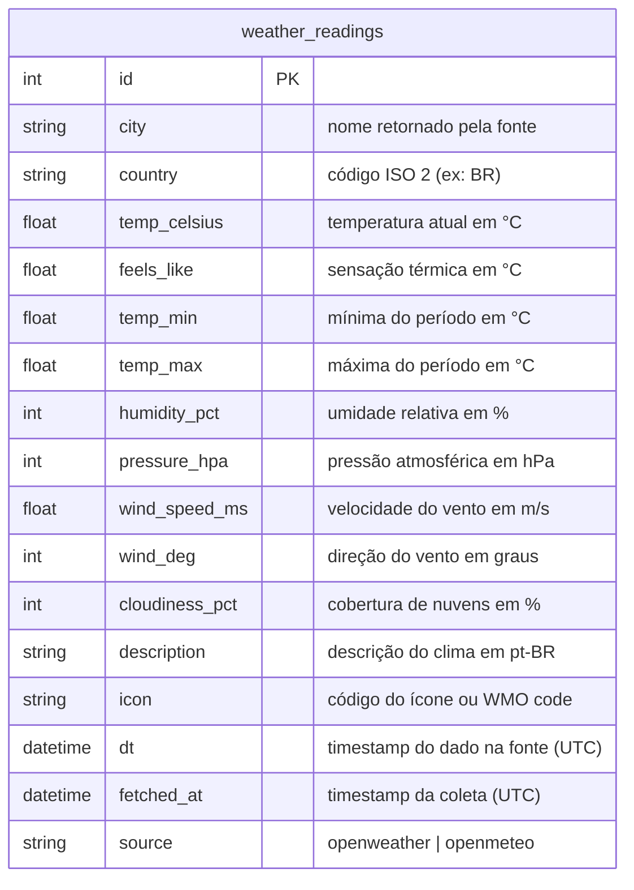
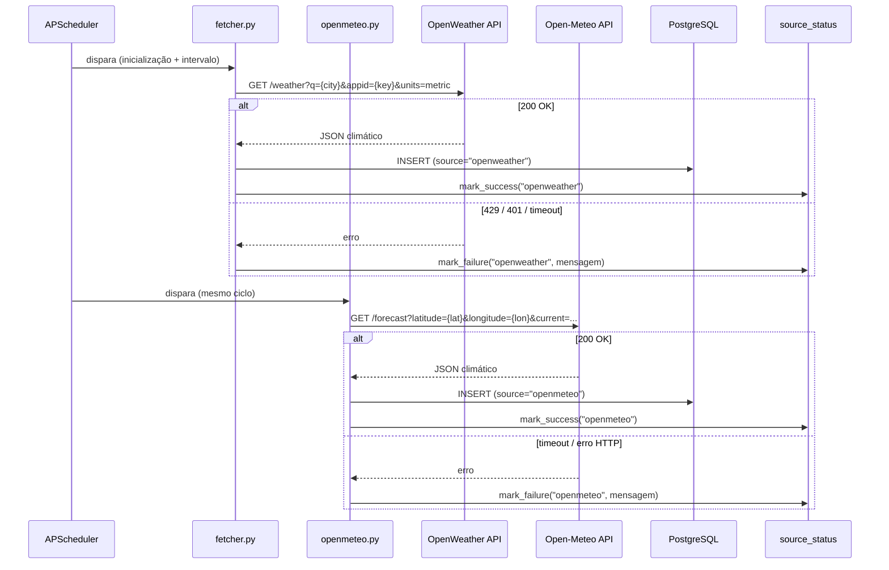
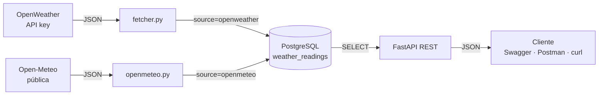
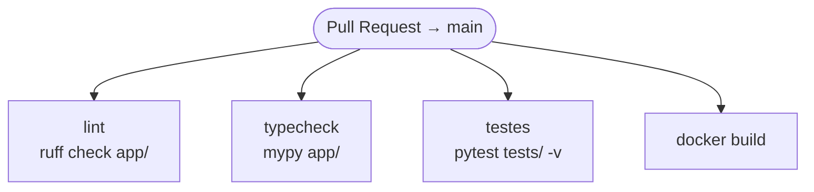

# GnTech Weather API

Pipeline de dados climáticos desenvolvido como desafio técnico. Coleta automaticamente dados
de múltiplas fontes públicas, armazena em PostgreSQL e os expõe via API REST documentada com
Swagger. Todo o ambiente — API e banco — sobe com um único comando Docker.

## Como subir o projeto

```bash
# Desenvolvimento (hot-reload, Swagger disponível)
docker-compose up --build

# Produção/avaliação (sem hot-reload, Swagger indisponível)
docker-compose -f docker-compose.prod.yml up --build
```

| Serviço | Desenvolvimento | Produção/avaliação |
|---|---|---|
| API REST | http://localhost:8000 | http://localhost:8000 |
| Swagger UI | http://localhost:8000/docs | indisponível (404) |
| ReDoc | http://localhost:8000/redoc | indisponível (404) |
| PostgreSQL | localhost:5432 | localhost:5432 |

Na inicialização o container executa as migrations automaticamente e realiza a primeira coleta
de todas as fontes — o banco já estará populado quando o Swagger carregar.

## Variáveis de ambiente

```bash
cp .env.example .env
```

| Variável | Descrição | Exemplo |
|---|---|---|
| `OPENWEATHER_API_KEY` | Chave gratuita em openweathermap.org | `abc123...` |
| `DATABASE_URL` | String de conexão PostgreSQL | `postgresql://weather:weather@db:5432/weather_db` |
| `POSTGRES_USER` | Usuário do banco | `weather` |
| `POSTGRES_PASSWORD` | Senha do banco | `weather` |
| `POSTGRES_DB` | Nome do banco | `weather_db` |
| `CITIES` | Cidades monitoradas, separadas por `;` | `Florianopolis,BR` |
| `CITIES_COORDS` | Coordenadas `lat,lon` em mesma ordem que `CITIES`, separadas por `;` | `-27.5954,-48.548` |
| `FETCH_INTERVAL_MINUTES` | Intervalo entre coletas | `30` |
| `ENV` | `development` habilita Swagger | `development` |

> A chave da OpenWeather pode levar até 10 minutos para ativar após o cadastro. Se o fetcher
> retornar 401 na primeira execução, aguarde — o próximo ciclo funcionará normalmente.

## Modelo de dados



> `dt` é o timestamp do dado na fonte — pode refletir cache de até 10 minutos.
> `fetched_at` é o momento exato da requisição.
> `source` identifica a origem, permitindo comparar leituras entre fontes no mesmo endpoint.

### Mapeamento requisito → implementação

| Requisito do enunciado | Implementação |
|---|---|
| Requisição GET com parâmetros dinâmicos | OpenWeather: `?q={city},{country}&units=metric` / Open-Meteo: `?latitude={lat}&longitude={lon}&current=...` |
| Autenticação por chave de API | OpenWeather usa `appid` na query string; chave em `.env`, nunca no código |
| Armazenar em banco relacional | Tabela `weather_readings` no PostgreSQL via SQLAlchemy ORM |
| API REST para consulta | `GET /readings`, `GET /readings/latest`, `GET /readings/stats` |
| Documentação Swagger | `/docs` nativo do FastAPI, indisponível em produção |

## Arquitetura

### Fontes integradas

| Fonte | Autenticação | Endpoint |
|---|---|---|
| [OpenWeather](https://openweathermap.org/api) | API key | `api.openweathermap.org/data/2.5/weather` |
| [Open-Meteo](https://open-meteo.com) | Nenhuma — pública | `api.open-meteo.com/v1/forecast` |

### Ingestor

Dois fetchers independentes rodam em background via APScheduler. Executam na inicialização
e repetem no intervalo configurado. A falha de uma fonte não afeta a outra — cada uma
atualiza seu próprio registro de saúde em `source_status`.



### API REST

FastAPI 0.115 + SQLAlchemy 2.0 + Uvicorn. Todos os endpoints leem exclusivamente do banco.

| Método | Rota | Descrição |
|---|---|---|
| GET | `/health` | Healthcheck do serviço |
| GET | `/readings` | Lista leituras com filtros opcionais |
| GET | `/readings/latest` | Última leitura de cada fonte |
| GET | `/readings/stats` | Estatísticas agregadas por cidade |
| GET | `/sources/status` | Saúde de cada fonte de dados |

**Parâmetros de query:**

| Parâmetro | Tipo | Endpoints | Descrição |
|---|---|---|---|
| `city` | string (max 100) | readings, latest, stats | Busca parcial, case-insensitive |
| `source` | string[] | readings, stats | `openweather`, `openmeteo` — sem filtro retorna todas |
| `from_dt` | datetime UTC | readings, stats | Data/hora inicial do período |
| `to_dt` | datetime UTC | readings, stats | Data/hora final do período |
| `limit` | int (1–500) | readings | Máximo de resultados, padrão 100 |

## Fluxo geral



## Análise de segurança

Resultado dos testes executados via coleção Postman (`postman/GnTech-Weather-API.postman_collection.json`).

| # | Vetor (OWASP API Top 10) | Status | Evidência |
|---|---|---|---|
| 1 | API3: SQL Injection via `city` | ✅ Mitigado | `?city=Florianopolis' OR '1'='1` → 200 com array vazio; ORM parametrizado |
| 2 | API3: SQL Injection via `from_dt` | ✅ Mitigado | `?from_dt=2026-01-01' OR '1'='1` → 422; Pydantic rejeita antes de tocar no banco |
| 3 | API4: Input oversized via `city` | ✅ Mitigado | `?city=AAA...` (>100 chars) → 422; `max_length=100` via Pydantic |
| 4 | API4: Consumo excessivo via `limit` | ✅ Mitigado | `?limit=99999` → 422; limitado a `le=500` |
| 5 | API8: Swagger em produção | ✅ Mitigado | `GET /docs` com `docker-compose.prod.yml` → 404 |
| 6 | API8: Chave de API exposta nas respostas | ✅ Mitigado | Nenhuma resposta contém `appid`; chave em `.env`, nunca serializada |
| 7 | API8: Credenciais no histórico Git | ✅ Mitigado | `.env` no `.gitignore` desde o primeiro commit |
| 8 | Intervalo de datas inválido | ✅ Mitigado | `?from_dt=2026-12-31&to_dt=2026-01-01` → 422 com mensagem descritiva |

**Legenda:** ✅ Mitigado · ⚠️ Vulnerável · N/A Não aplicável

## Testes

A coleção Postman em [`postman/`](./postman) cobre os fluxos principais e os vetores de segurança.
Ver [`postman/README.md`](./postman/README.md) para instruções de importação e execução via Newman.

Pipeline CI/CD em `.github/workflows/ci.yml`:



## Decisões de design

### Por que FastAPI em vez de Django?

O enunciado pede API REST com Swagger. FastAPI entrega Swagger UI nativamente, valida inputs
via Pydantic e é diferencial explícito na vaga. Para um serviço de dados com uma tabela,
Django adicionaria complexidade desnecessária.

### Por que duas fontes?

OpenWeather e Open-Meteo cobrem dois padrões distintos de integração: autenticação por chave
e API pública sem auth. Schemas diferentes mapeados para um modelo único — a falha de uma
fonte não afeta a outra.

### Por que INMET não foi integrado?

INMET foi avaliado como terceira fonte. Os testes a partir do container Docker retornaram
`Server disconnected without sending a response` em todos os endpoints da API pública, mesmo
com credenciais. Uma fonte que falha sistematicamente prejudica a demonstração. A arquitetura
suporta adição futura: criar `inmet.py` e registrá-lo no `source_status`.

### Por que `dt` e `fetched_at` separados?

`dt` é o timestamp do dado na fonte — pode refletir cache de até 10 minutos na OpenWeather.
`fetched_at` é o momento da requisição. Com ambos é possível diagnosticar se dados
desatualizados vêm da fonte ou da ingestão.

### Degradação graciosa por fonte

Se uma fonte falha, o fetcher loga o erro, atualiza o `source_status` e segue para a próxima.
A API continua servindo os dados disponíveis. `GET /sources/status` expõe `is_healthy`,
`last_success` e `error` por fonte para diagnóstico explícito.

### Tabela plana sem normalização de cidade/país

O enunciado pede uma tabela. Normalizar `city` e `country` introduziria JOINs sem benefício
para o escopo.
