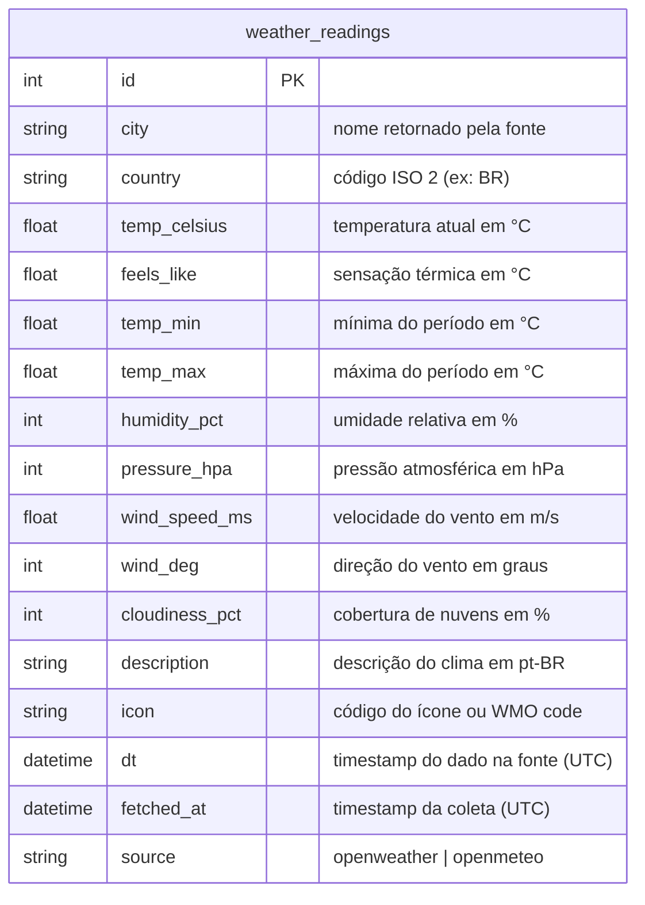
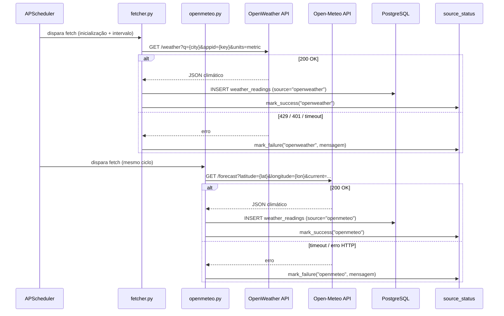
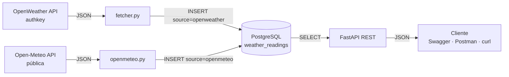
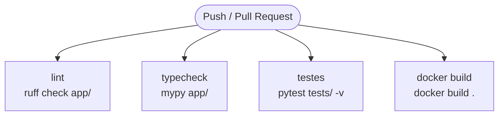

# GnTech Weather API

Pipeline de dados climáticos desenvolvido como desafio técnico. Coleta automaticamente dados
de múltiplas fontes públicas, armazena em PostgreSQL e os expõe via API REST documentada com
Swagger. Todo o ambiente — API e banco — sobe com um único comando Docker.

## Como subir o projeto

```bash
# Desenvolvimento (hot-reload, Swagger disponível)
docker-compose up --build

# Produção/avaliação (sem hot-reload, Swagger indisponível)
docker-compose -f docker-compose.prod.yml up --build
```

| Serviço | Desenvolvimento | Produção/avaliação |
|---|---|---|
| API REST | http://localhost:8000 | http://localhost:8000 |
| Swagger UI | http://localhost:8000/docs | indisponível (404) |
| ReDoc | http://localhost:8000/redoc | indisponível (404) |
| PostgreSQL | localhost:5432 | localhost:5432 |

Na inicialização o container executa automaticamente as migrations (`alembic upgrade head`) e
realiza a primeira coleta de todas as fontes — o banco já estará populado quando o Swagger carregar.

## Variáveis de ambiente

Copie `.env.example` para `.env` e preencha antes de subir:

```bash
cp .env.example .env
```

| Variável | Descrição | Exemplo |
|---|---|---|
| `OPENWEATHER_API_KEY` | Chave da OpenWeather API (gratuita em openweathermap.org) | `abc123...` |
| `DATABASE_URL` | String de conexão PostgreSQL | `postgresql://weather:weather@db:5432/weather_db` |
| `POSTGRES_USER` | Usuário do banco | `weather` |
| `POSTGRES_PASSWORD` | Senha do banco | `weather` |
| `POSTGRES_DB` | Nome do banco | `weather_db` |
| `CITIES` | Cidades monitoradas, separadas por `;` | `Florianopolis,BR` |
| `CITIES_COORDS` | Coordenadas lat,lon em mesma ordem que `CITIES`, separadas por `;` | `-27.5954,-48.548` |
| `FETCH_INTERVAL_MINUTES` | Intervalo entre coletas automáticas | `30` |
| `ENV` | Ambiente — `development` habilita Swagger | `development` |

> A chave da OpenWeather pode levar até 10 minutos para ativar após o cadastro. Se o fetcher
> retornar 401 na primeira execução, aguarde e o próximo ciclo funcionará normalmente.

## Modelo de dados



> `dt` é o timestamp do dado na fonte — pode refletir cache de até 10 minutos.
> `fetched_at` é o momento exato da requisição da aplicação.
> `source` identifica a origem do dado, permitindo comparar leituras entre fontes.

### Mapeamento requisito → implementação

| Requisito do enunciado | Implementação |
|---|---|
| Requisição GET com parâmetros dinâmicos | OpenWeather: `?q={city},{country}&units=metric` / Open-Meteo: `?latitude={lat}&longitude={lon}&current=...` |
| Autenticação por chave de API | OpenWeather usa `appid` na query string; Open-Meteo é pública sem autenticação |
| Armazenar em banco relacional | Tabela `weather_readings` no PostgreSQL via SQLAlchemy ORM |
| API REST para consulta dos dados | `GET /readings`, `GET /readings/latest`, `GET /readings/stats`, `GET /sources/status` |
| Documentação Swagger | Swagger UI em `/docs` (FastAPI nativo), desabilitado em produção |

## Arquitetura

### Fontes de dados integradas

| Fonte | Autenticação | Dados retornados |
|---|---|---|
| [OpenWeather](https://openweathermap.org/api) | API key (`OPENWEATHER_API_KEY`) | Temperatura, umidade, vento, pressão, nuvens, descrição |
| [Open-Meteo](https://open-meteo.com) | Nenhuma — API pública gratuita | Temperatura, umidade, vento, pressão, nuvens, código WMO |

### Ingestor (fetcher)

Dois fetchers independentes rodam em background via APScheduler no `lifespan` do FastAPI.
Ambos executam na inicialização e repetem no intervalo configurado em `FETCH_INTERVAL_MINUTES`.
Cada um atualiza o registro de saúde da sua fonte em `source_status`, independente do outro —
a falha de uma fonte não impacta a coleta da outra.



### API REST

FastAPI 0.115 + SQLAlchemy 2.0 + Uvicorn. Todos os endpoints leem do banco — nenhuma rota
chama APIs externas diretamente.

| Método | Rota | Descrição |
|---|---|---|
| GET | `/health` | Healthcheck do serviço |
| GET | `/readings` | Lista leituras com filtros opcionais |
| GET | `/readings/latest` | Última leitura de cada fonte com status de saúde |
| GET | `/readings/stats` | Estatísticas agregadas por cidade |
| GET | `/sources/status` | Estado atual de cada fonte de dados |

**Parâmetros comuns:**

| Parâmetro | Tipo | Endpoints | Descrição |
|---|---|---|---|
| `city` | string (max 100) | readings, latest, stats | Filtra por cidade (busca parcial) |
| `source` | string[] | readings, stats | `openweather`, `openmeteo` — sem filtro retorna todas |
| `from_dt` | datetime UTC | readings, stats | Data/hora inicial do período |
| `to_dt` | datetime UTC | readings, stats | Data/hora final do período |
| `limit` | int (1–500) | readings | Máximo de resultados, padrão 100 |

**Resposta de `/readings/latest`:**

```json
[
  {
    "source": "openweather",
    "is_healthy": true,
    "last_success": "2026-08-30T06:01:37Z",
    "error": null,
    "data": { "city": "Florianópolis", "temp_celsius": 17.5, "..." }
  },
  {
    "source": "openmeteo",
    "is_healthy": false,
    "last_success": "2026-08-30T05:31:20Z",
    "error": "timeout ao buscar 'Florianopolis'",
    "data": null
  }
]
```

## Fluxo geral



## Análise de segurança

Resultado dos testes executados via coleção Postman (`postman/GnTech-Weather-API.postman_collection.json`).

| # | Vetor (OWASP API Top 10) | Status | Evidência |
|---|---|---|---|
| 1 | API3: SQL Injection via `city` | 🛡️ Blindado | `?city=Florianopolis' OR '1'='1` → 200 com array vazio; ORM parametrizado, sem interpolação de string |
| 2 | API3: SQL Injection via `from_dt` | 🛡️ Blindado | `?from_dt=2026-01-01' OR '1'='1` → 422; Pydantic rejeita o tipo antes de tocar no banco |
| 3 | API4: Input oversized via `city` | 🛡️ Blindado | `?city=AAA...` (>100 chars) → 422; `max_length=100` via `Query(max_length=100)` |
| 4 | API4: Consumo excessivo via `limit` | 🛡️ Blindado | `?limit=99999` → 422; limitado a `le=500` via Pydantic |
| 5 | API8: Swagger em produção | 🛡️ Blindado | `GET /docs` com `docker-compose.prod.yml` → 404; `docs_url=None` quando `ENV=production` |
| 6 | API8: Chave de API exposta nas respostas | 🛡️ Blindado | Respostas não contêm `appid` nem `openweather`; chave lida de `.env`, nunca serializada |
| 7 | API8: Credenciais no histórico Git | 🛡️ Blindado | `.env` no `.gitignore` desde o primeiro commit |
| 8 | Intervalo de datas inválido | 🛡️ Blindado | `?from_dt=2026-12-31&to_dt=2026-01-01` → 422 com mensagem descritiva |

**Legenda:** 🛡️ Blindado · ⚠️ Vulnerável · N/A Não aplicável

## Testes

A coleção Postman em [`postman/`](./postman) cobre os fluxos principais e os vetores de segurança
acima. Ver [`postman/README.md`](./postman/README.md) para instruções de importação e execução via Newman.

O pipeline CI/CD (`.github/workflows/ci.yml`) executa em todo push para `main`:



## Decisões de design

### Por que FastAPI em vez de Django?

O enunciado pede uma API REST com Swagger. FastAPI entrega o Swagger UI nativamente sem
dependências extras, valida inputs via Pydantic automaticamente e é listado como diferencial
explícito na descrição da vaga. Para um serviço de dados com uma tabela, Django adicionaria
complexidade sem benefício proporcional.

### Por que duas fontes e não apenas uma?

A vaga exige experiência em **integração entre sistemas**. Usar OpenWeather e Open-Meteo
demonstra na prática: autenticação por chave (OpenWeather), integração com API pública sem
auth (Open-Meteo), mapeamento de schemas diferentes para um modelo único, e resiliência
— a falha de uma fonte não derruba a outra.

### Por que INMET não foi integrado?

O INMET (Instituto Nacional de Meteorologia) foi avaliado como terceira fonte. Os testes
realizados a partir do container Docker retornaram `Server disconnected without sending a response`
em todos os endpoints da API pública (`apitempo.inmet.gov.br`), mesmo com token. A instabilidade
da API inviabiliza seu uso em produção — uma fonte que falha sistematicamente prejudica a
demonstração em vez de agregá-la. A arquitetura suporta a adição futura: basta criar `inmet.py`
e registrá-lo no `source_status`.

### Por que `dt` e `fetched_at` como campos separados?

`dt` é o timestamp do dado na fonte — pode refletir cache de até 10 minutos na OpenWeather.
`fetched_at` é o momento da requisição da aplicação. Com ambos é possível calcular a latência
de cache da fonte e diagnosticar se dados desatualizados vêm da fonte ou da nossa ingestão.

### Por que tabela plana em vez de normalizar cidade/país?

O enunciado pede uma tabela para demonstrar modelagem e persistência. Normalizar `city` e
`country` introduziria JOINs sem benefício para o escopo. Decisão consciente, não omissão.

### Degradação graciosa por fonte

Se uma fonte falha (429, timeout, erro HTTP), o fetcher loga o erro, atualiza o `source_status`
e segue para a próxima fonte. A API continua servindo os dados disponíveis no banco. O endpoint
`GET /readings/latest` expõe o estado de cada fonte — `is_healthy`, `last_success` e `error` —
permitindo ao consumidor identificar qual fonte está operacional e qual falhou.
